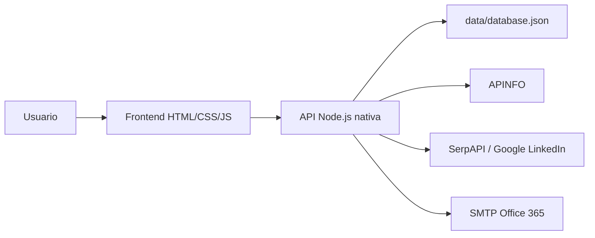
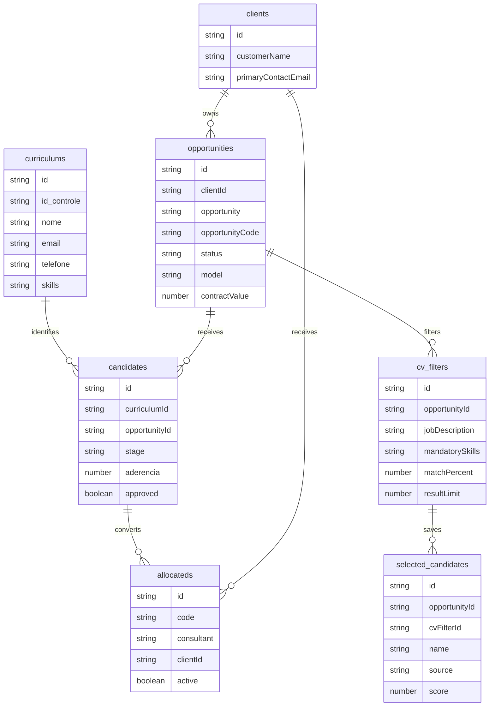

# Gestao do Negocio Alcateia

MVP web para gestao comercial e operacional da Alcateia, cobrindo clientes,
oportunidades, filtros de CVs, busca de candidatos, candidatos selecionados,
candidatos internos, alocados e indicadores do dashboard.

O projeto foi construido sem etapa de build: Node.js nativo no backend e
HTML/CSS/JavaScript puro no frontend. A persistencia atual e feita em arquivo
JSON para acelerar validacao operacional.

## Stack

- Node.js com servidor HTTP nativo
- HTML, CSS e JavaScript sem framework
- Persistencia em `data/database.json`
- Testes com `node:test`
- Integracao APINFO via busca autenticada
- Integracao LinkedIn via SerpAPI
- Envio de e-mail via SMTP/Office 365, dependente de permissao SMTP AUTH

## Como Executar

```bash
npm start
```

Abra:

```text
http://localhost:3000
```

Neste ambiente, quando `npm` nao estiver disponivel, execute diretamente:

```bash
node server.js
```

## Testes

```bash
npm test
```

Ou:

```bash
node --test
```

Os testes cobrem regras centrais de indicadores, usuarios, candidatos,
alocados, filtros de CVs, historico de etapas e normalizacao de dados.

## Variaveis De Ambiente

Crie um arquivo `.env` a partir de `.env.example`.

Importante: `.env` contem credenciais reais e nao deve ser versionado nem
enviado em pacote.

Variaveis usadas:

```text
APINFO_USER=
APINFO_PASSWORD=
SERPAPI_KEY=
SMTP_HOST=smtp.office365.com
SMTP_PORT=587
SMTP_USER=
SMTP_PASSWORD=
SMTP_FROM=
SMTP_SECURE=false
SMTP_TO_TESTE=
```

Usuarios podem ser criados a partir de `APP_USER_01_*` quando
`SEED_USERS_FROM_ENV=true`. Por seguranca, senhas de usuarios existentes nao
sao sobrescritas em deploy normal. Mesmo que `RESET_ENV_USER_PASSWORDS=true`
esteja configurado por engano, o reset so ocorre com a confirmacao adicional
`ALLOW_ENV_USER_PASSWORD_RESET=CONFIRMO_RESETAR_SENHAS`.

### Observacao Sobre Office 365

O envio SMTP depende de o Microsoft 365 permitir SMTP autenticado para a caixa
postal usada. Se o servidor responder `535 Authentication unsuccessful`, o
codigo chegou ao SMTP, mas a Microsoft recusou a autenticacao. Normalmente isso
exige habilitar **Authenticated SMTP**, usar senha de aplicativo ou configurar
uma politica/OAuth apropriada.

## Acesso Da Base Demo

O pacote de repasse tecnico inclui somente um usuario demonstrativo:

```text
Usuario: tecnico@demo.local
Senha inicial: alcateia
```

No primeiro acesso, o sistema exige troca de senha. As senhas sao armazenadas
com hash `scrypt`, nao em texto puro. Usuarios operacionais pertencem somente a
base real, que deve ser transferida por canal seguro quando necessario.

## Telas E Funcionalidades

### Dashboard

- Indicadores principais da operacao
- WON no mes
- WON no mes por modelo
- Valor fechado no mes
- Oportunidades em aberto
- Oportunidades abertas
- Candidatos
- Clientes
- Aderencia media
- Grafico de candidatos por etapa
- Grafico de oportunidades por status
- Pizza de alocados ativos por cliente
- Tempo medio por etapa

### Clientes

- Cadastro de clientes
- Campos de contato principal
- Observacao
- Edicao ao clicar em um registro

### Oportunidades

- Cadastro e manutencao de oportunidades
- Cliente
- Status: `WON`, `LOST`, `Freezing`, `Closed`, `Open`
- Modelo: `Alocacao`, `Hunting`, `Projeto`, `Consultoria`
- Abertura e mes/data de fechamento
- Quantidade, quantidade fechada e valor de contrato
- Filtros por cliente, oportunidade, status e mes de fechamento

### Filtro de CVs

- Oportunidade vinculada
- Job Description
- Habilidades Obrigatorias, limitadas a 20 caracteres
- Fontes de busca por checkbox:
  - APINFO
  - LINKEDIN
  - ALCATEIA
- UF e cidade com validacao por UF
- Nivel de ingles:
  - tecnico
  - intermediario
  - fluente
- Percentual minimo de acerto
- Quantidade de retorno
- Botao Buscar Candidatos
- Resultados da Busca
- Rejeitados com motivo de rejeicao
- Botao Salvar Selecionados
- Exclusao de filtros salvos por botao de lixeira

### Busca De Candidatos

Ao buscar candidatos, o sistema:

- Limpa resultados anteriores da tela
- Usa as fontes marcadas no filtro
- Popula APINFO com:
  - Palavras-chave = Habilidades Obrigatorias
  - Estado = Estado
  - Cidade = Cidade
- Consulta LinkedIn via SerpAPI quando marcado
- Ordena resultados e rejeitados por classificacao do Job Description
- Limita retornos pela quantidade definida no filtro
- Separa aprovados e rejeitados conforme o percentual minimo

### Candidatos Selecionados

- Consulta por oportunidade
- Lista candidatos salvos a partir do Filtro de CVs
- Campo Mensagem ao candidato
- Botao Salvar mensagem
- Checkbox para marcar candidatos para envio
- Botao Enviar mensagem
- Botao Excluir em cada candidato selecionado

O envio de mensagem atualmente envia um e-mail de teste para o destinatario
configurado, contendo os e-mails encontrados dos candidatos e o texto da
mensagem ao candidato.

### Banco de Talentos

- Consulta por nome e skills
- Listagem de talentos com:
  - id_controle
  - nome
  - email
  - telefone
  - LinkedIn
  - skills
  - data de atualizacao

### Candidatos

- Cadastro manual de candidatos
- Vinculo com Banco de Talentos
- Vinculo com oportunidade
- Etapa
- Aderencia
- Valor hora
- Observacao
- Checkbox Aprovado
- Movimentacao entre etapas
- Botao Selecionado

Ao clicar em **Selecionado**:

- O sistema pede confirmacao
- Abre uma tela para completar dados de alocacao
- Marca o candidato como aprovado
- Move o candidato para a etapa Aprovado
- Cria o registro correspondente em Alocados

### Alocados

- Cadastro e manutencao de alocados
- Consulta por consultor ou cliente
- Campos:
  - ID
  - Codigo
  - Consultor
  - Skill
  - Cliente
  - Valor Hora
  - Fone
  - Email Consultor
  - Inicio
  - Ativo
  - Termino
  - Gestor
  - Email Gestor
  - Fone Gestor

## Etapas Dos Candidatos

1. Triagem
2. Entrevista Alcateia
3. Entrevista tecnica/gestor
4. Proposta
5. Aprovado
6. Reprovado

## Estrutura

```text
.
|-- apinfo.js
|-- db.js
|-- server.js
|-- smtp.js
|-- package.json
|-- README.md
|-- data/
|   `-- database.json
|-- public/
|   |-- app.js
|   |-- index.html
|   |-- styles.css
|   |-- brand/
|   |   `-- logo-alcateia.png
|   `-- uploads/
|-- scripts/
`-- test/
    `-- db.test.js
```

## Arquitetura Atual



## Modelo Conceitual



## Limites Conhecidos

- Persistencia em JSON, adequada para MVP, nao para producao com concorrencia
  alta
- RBAC completo por perfil ainda nao implementado
- Busca Alcateia esta marcada como futura
- Envio Office 365 depende de permissao SMTP AUTH da conta
- Integracao LinkedIn depende da chave SerpAPI
- APINFO depende de credenciais validas e disponibilidade do site

## Proximas Evolucoes Recomendadas

- Migrar persistencia para PostgreSQL
- Adicionar Prisma ou outro ORM
- Criar RBAC real por perfil
- Registrar auditoria de alteracoes
- Criar fila para buscas APINFO/LinkedIn
- Evoluir envio de e-mail para Microsoft Graph/OAuth
- Implementar busca Alcateia
- Criar logs operacionais estruturados

## Integração com Banco de Talentos antigo

Esta versão mantém o frontend do Gestão do Negócio Alcateia, mas a aba **Banco de Talentos** pode ler diretamente a base antiga no MongoDB.

### Variáveis obrigatórias para ler candidatos do MongoDB

Copie `.env.example` para `.env` e preencha:

```env
MONGODB_URL=mongodb+srv://...
MONGODB_DB=Banco_de_Talentos
MONGODB_CURRICULUM_COLLECTION=curriculums
MONGODB_LEGACY_CURRICULUM_COLLECTION=candidatos
MONGODB_CURRICULUM_LIMIT=5000
```

Com `MONGODB_URL` preenchido, o endpoint `/api/bootstrap` carrega os currículos da collection `curriculums`. A rotina antiga de leitura de e-mails também grava e conta essa mesma collection, mantendo o total do e-mail de log igual ao total exibido na tela de talentos. Se a conexão falhar, a tela usa `data/database.json` como fallback e mostra o erro na própria aba.

### Rotina antiga de leitura de e-mails

O código antigo foi preservado em `legacy_banco_talentos/` e pode ser acionado pelo botão **Processar Leitura de E-mails** da aba Banco de Talentos.

Antes de usar, instale as dependências Python:

```bash
npm run install:legacy
```

Depois preencha também no `.env`:

```env
PYTHON_EXECUTABLE=python
GRAPH_CLIENT_ID=
GRAPH_CLIENT_SECRET=
GRAPH_TENANT_ID=
GRAPH_EMAIL=
GRAPH_EMAIL_TO=
PROCESSING_LOGS_ENABLED=false
DIAS_ATRAS=7
GEMINI_API_KEY=
GEMINI_MODEL=gemini-2.5-flash-lite
```

O botão chama `POST /api/processar-emails`, executa `legacy_banco_talentos/run_process_emails.py` em background, bloqueia novo processamento enquanto estiver rodando e consulta o status em `/api/processamento-status/:job_id`.

Em ambiente local/homologacao, mantenha `PROCESSING_LOGS_ENABLED=false` para nao gerar arquivo de log nem enviar resumo por e-mail. Em PROD, configure `PROCESSING_LOGS_ENABLED=true` ou use a URL/servico oficial de producao.

### Busca na tela

A busca por **Nome** filtra pelo campo `nome`.
A busca por **Palavra no Currículo** procura em nome, e-mail, telefone, LinkedIn, skills, formação, cursos, conhecimento técnico, experiência profissional, idiomas, endereço e `id_controle`.
